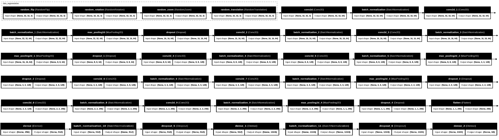
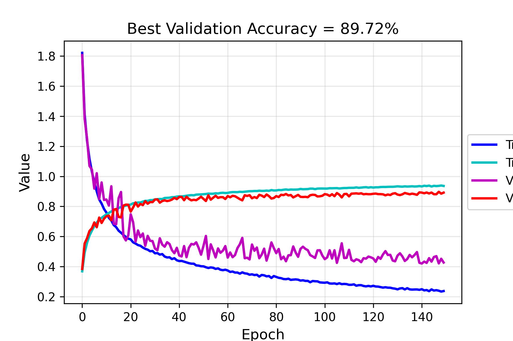
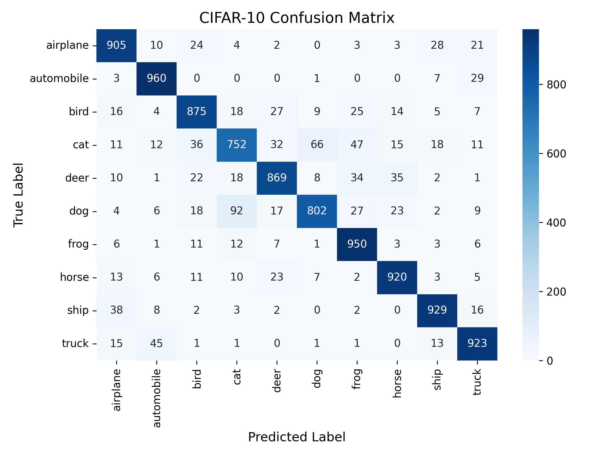

# 🧠 CIFAR‑10 Convolutional Neural Network (TensorFlow / Keras)

---

## 📘 Project Overview

A fully implemented **Convolutional Neural Network (CNN)** for **CIFAR‑10** image classification, written in **TensorFlow 2 / Keras**.

This project demonstrates:
- Modern CNN architecture design (Conv‑BN‑Pool‑Dropout)
- **Data augmentation** integrated directly into the model
- **He initialization**, **L2 regularization**, and **Batch Normalization**
- **Adam optimizer** with **exponential‑decay** learning rate schedule  
- Real‑time **training visualization** and **evaluation** via confusion matrix + classification report  

---

## 📂 Dataset: CIFAR‑10

**CIFAR‑10** contains 60 000 color images (32 × 32 × 3) in 10 classes:
> ✈️ airplane • 🚗 automobile • 🐸 frog • 🐱 cat • 🐶 dog • 🐴 horse • 🐦 bird • 🚢 ship • 🦌 deer • 🚚 truck  

- Images normalized to [0 – 1]  
- Labels converted to one‑hot vectors using `to_categorical()`  
- Usually split: 80 % train / 20 % validation + separate test set  

---

## 🧠 Model Architecture

  

**Figure 1.** CIFAR‑10 CNN architecture (Graphviz horizontal view).  
Conv blocks use *HeNormal initialization* + *L2 regularization (1e‑6 conv, 1e‑5 dense)* and progressive **dropout (0.25 → 0.4)**.  
Final classifier is **Dense(10)** activated by `softmax` and initialized with *GlorotUniform*.  
Optimizer = **Adam+ExponentialDecay** *(LR = 1e‑3, decay rate = 0.9, every 10 000 steps)*.

✅ **Total Params:** 2.85 M (10.9 MB)  
✅ **Trainable Params:** 2.84 M  
✅ **Regularization:** L2 → Dense (1e‑5)  

---
## 🧾 Results Summary

| Metric | Value |
|--------|-------|
| **Best Validation Accuracy** | ≈ 88 % |
| **Test Accuracy** | ≈ 87 % |
| **Test Loss** | ~ 0.46 |
| **Total Parameters** | 2,848,202 |
| **Loss Function** | `categorical_crossentropy` |
| **Optimizer** | Adam + ExponentialDecay (LR: 1e‑3 → decay 0.9 / 10 000 steps) |
| **Regularization** | L2 Conv = 1e‑6 · Dense = 1e‑5; Dropout = 0.25 / 0.4 |
| **Augmentation** | Flip · Rotation · Zoom · Translation |
| **Framework** | TensorFlow 2.16 / Keras |
| **Python Version** | 3.10 |

## 🎨 Visuals & Results Summary

### 📈 Training & Validation Curves

  

**Figure 2.** Loss and accuracy progress over 150 epochs (batch size 128).  
The smooth convergence and small gap indicate well‑balanced regularization.  
Best validation accuracy: **≈ 87 %** on held‑out set.

---

### 🔍 Confusion Matrix & Classification Report

  

**Figure 3.** CIFAR‑10 test set confusion matrix with per‑class performance.  
Diagonal dominance shows robust feature discrimination.  
Remaining misclassifications occur mostly between visually similar classes  
(*cat ↔ dog*, *automobile ↔ truck*), highlighting realistic domain overlap.

---
